# Microsimulación de aumentos de la Tarjeta Uruguay Social y pobreza multidimensional

**Uruguay, ECH 2025 · proyección predictiva, no causal**


¿Cuánta pobreza multidimensional quitaría un aumento de la principal transferencia
focalizada del país? Este estudio lo estima por microsimulación sobre la Encuesta
Continua de Hogares 2025, midiendo la pobreza con el instrumento oficial de Uruguay
— el **Índice de Pobreza Multidimensional (INE, 2024)** — y recorriendo la curva
completa de escenarios, desde +10% hasta +1000% del monto actual.

## El resultado en una mirada

Para el escenario central (+50% del monto de la TUS):

| Personas beneficiarias | Total del país | Costo |
|:---:|:---:|:---:|
| **−2,44 pp** de incidencia | **−0,25 pp** de incidencia | **$2.811 millones/año** |
| la lectura sustantiva de una política focalizada | el mismo efecto, diluido sobre 10 veces más personas | +50% del gasto TUS |

La brecha entre ambas lecturas no es una contradicción: la TUS cubre al 6,5% de los
hogares, que reúnen el 10,3% de las personas — y 2,44 pp × 0,103 = 0,25 pp. Toda
cifra de este repositorio es una **proyección condicionada a supuestos**, con sus dos
fuentes de incertidumbre (muestral y de simulación) reportadas por separado.

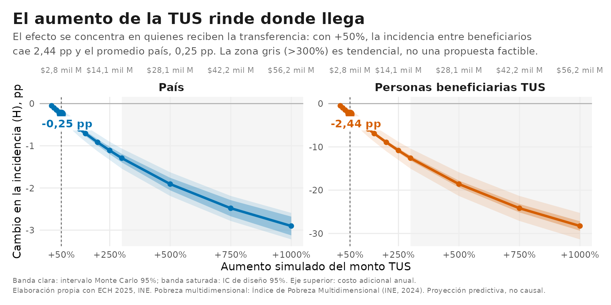

*Figura insignia: el efecto crece con el tamaño del aumento, con rendimientos
decrecientes claros después de +100–150%. [Panel completo](figures/png/01_el_aumento_rinde_donde_llega.png)
· [Versión interactiva](site/figures/01_el_aumento_rinde_donde_llega.html)*

## Resumen

El estudio combina quince modelos predictivos — uno por cada privación del índice —
que aprenden de los datos cómo se relaciona el ingreso de los hogares con cada
carencia, y una microsimulación Monte Carlo que aplica los aumentos hipotéticos al
ingreso de los hogares beneficiarios y recalcula las métricas oficiales. Antes de
proyectar, la línea de base reproduce las cifras oficiales del INE (las tres métricas
del índice y sus 15 indicadores, dentro de los márgenes publicados). Los efectos se
reportan en dos universos — beneficiarios y total del país — con intervalos de diseño
muestral y bandas Monte Carlo. Además de la curva de aumentos, el estudio evalúa la
política ya decidida para 2026 (aumento del Bono Crianza), compara reglas
alternativas de reparto a presupuesto constante y contrasta el comportamiento del
índice multidimensional con la pobreza monetaria. El enfoque es predictivo: proyecta
niveles coherentes con un ingreso mayor según los patrones observados, sin modelar
respuestas de comportamiento, precios ni oferta de servicios.

*This study microsimulates the effect of increasing Uruguay's main targeted cash
transfer (TUS) on official multidimensional poverty (INE, 2024) using the 2025
household survey. A +50% increase (≈ USD 70M/year) is projected to reduce the
headcount ratio by 2.44 pp among beneficiaries (0.25 pp nationally), with clearly
decreasing returns beyond +100–150%. Results are predictive projections, not causal
estimates.*

## Hallazgos principales

1. **La focalización funciona: el efecto vive donde llega el instrumento.**
   −2,44 pp de incidencia entre personas beneficiarias con +50%; el promedio nacional
   (−0,25 pp, unas 9.000 personas) es ese mismo efecto repartido en todo el país.
   → [figura 1](figures/png/01_el_aumento_rinde_donde_llega.png)
2. **El presupuesto es la variable de primer orden; la regla de reparto, de segundo.**
   Cinco formas de repartir el mismo dinero resultan estadísticamente indistinguibles
   entre sí. → [figura 7](figures/png/07_cuanto_rinde_y_como_repartir.png)
3. **El dinero rinde de forma casi constante hasta +100–150%** (~0,09 pp de incidencia
   nacional por cada $1.000 millones/año); después, rendimientos decrecientes claros.
   → [figura 1](figures/png/01_el_aumento_rinde_donde_llega.png)
4. **La transferencia tiene un límite honesto**: tres privaciones (asistencia escolar,
   pensiones, protección social de menores) casi no responden al ingreso y piden
   políticas sectoriales. → [figura 3](figures/png/03_donde_actua_el_dinero.png)
5. **El aumento 2026 del Bono Crianza tendría efecto real y medible en su población**:
   ~204 de los 24.702 hogares beneficiarios dejarían la pobreza multidimensional, con
   un costo anual de $284 millones. → [figura 6](figures/png/06_bono_crianza_2026.png)

## Las figuras

Las diez figuras del estudio, cada una en tres soportes: PNG (300 dpi), PDF vectorial
y **versión interactiva** con los valores exactos de cada escenario, accesible por
teclado. La galería completa está en [`site/`](site/index.html) (GitHub Pages).

| | | | | |
|:---:|:---:|:---:|:---:|:---:|
| [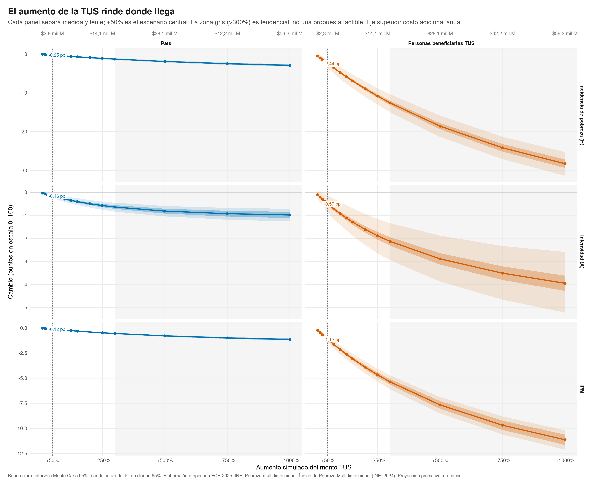](site/figures/01_el_aumento_rinde_donde_llega.html) | [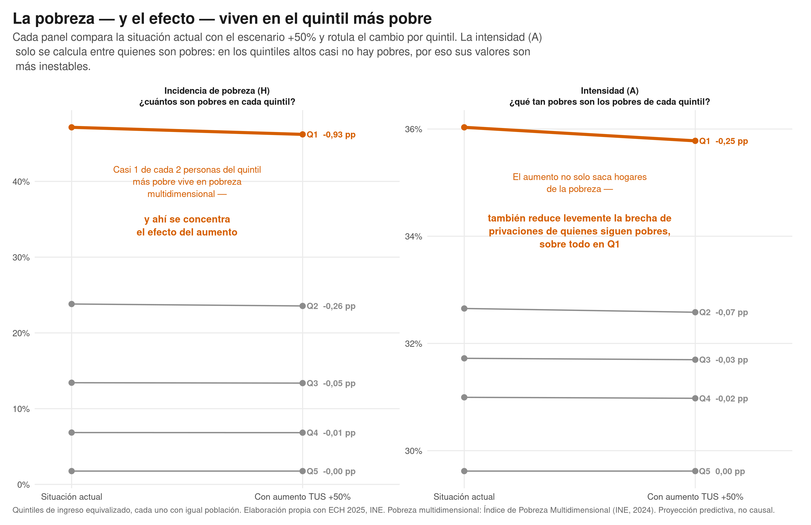](site/figures/02_pobreza_y_efecto_por_quintil.html) | [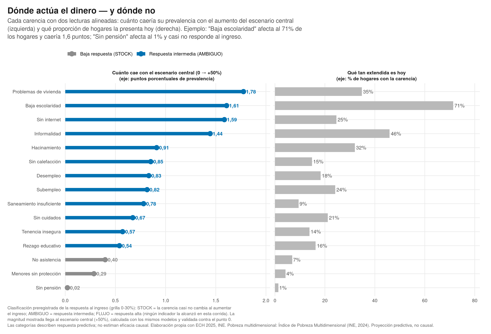](site/figures/03_donde_actua_el_dinero.html) | [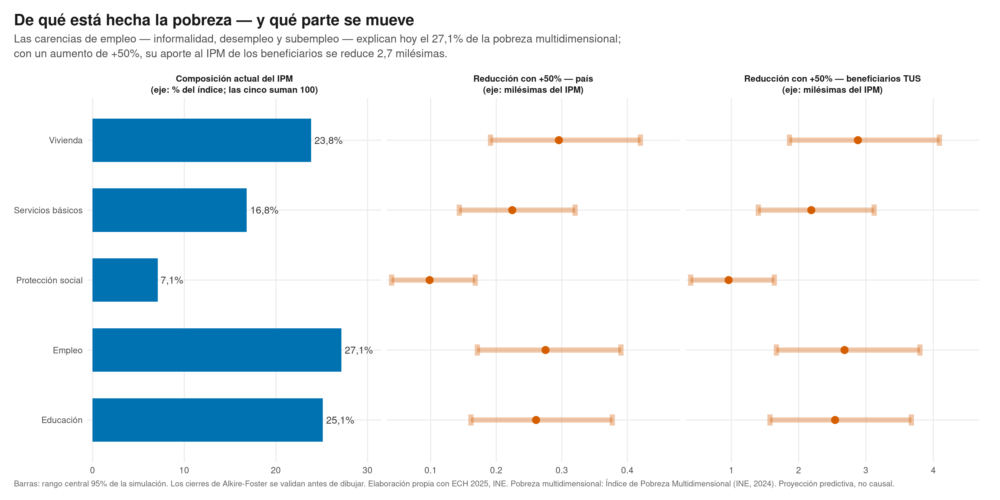](site/figures/04_de_que_esta_hecha_la_pobreza.html) | [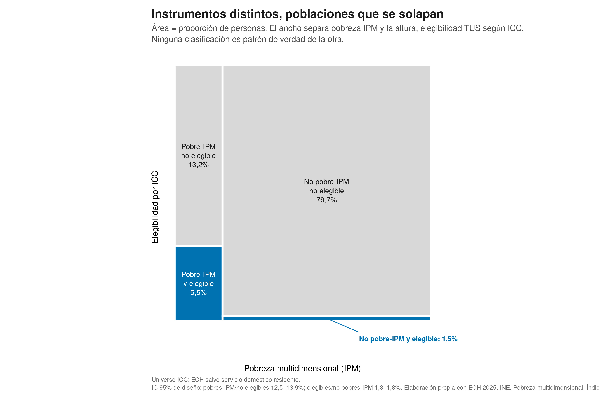](site/figures/05_instrumentos_y_poblaciones.html) |
| [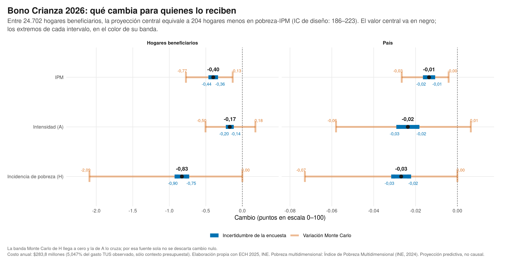](site/figures/06_bono_crianza_2026.html) | [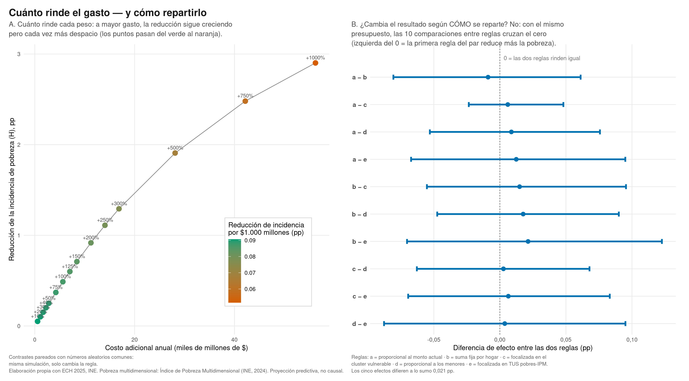](site/figures/07_cuanto_rinde_y_como_repartir.html) | [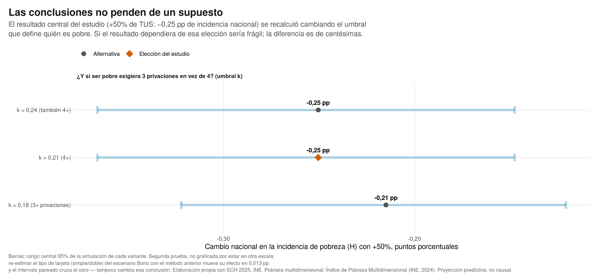](site/figures/08_conclusiones_y_supuestos.html) | [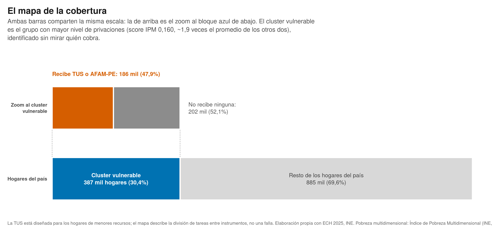](site/figures/09_mapa_de_la_cobertura.html) | [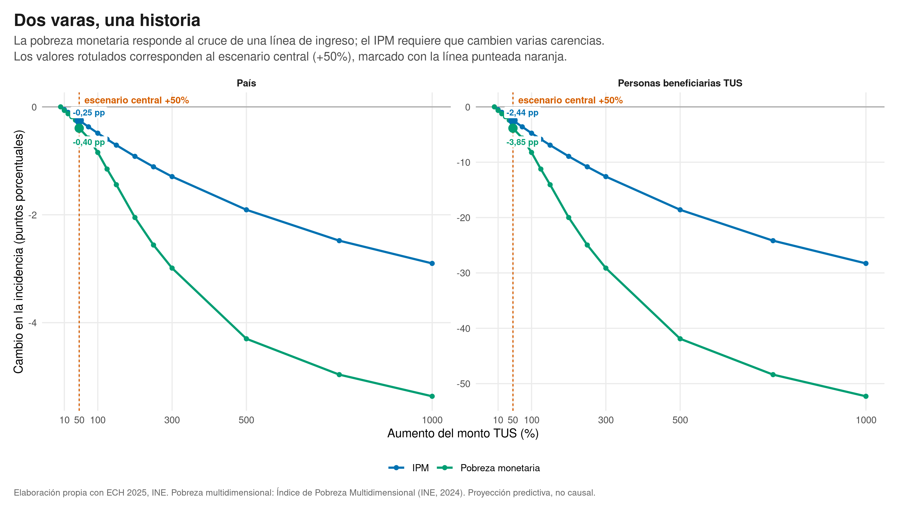](site/figures/10_dos_varas_una_historia.html) |

## Datos y gobernanza

- **Fuente**: [ECH 2025 del INE](https://www4.ine.gub.uy/Anda5/index.php/catalog/779/get-microdata),
  la encuesta oficial de hogares, representativa de todo el país.
- El análisis identifica a los hogares beneficiarios con apoyo de información
  administrativa. **Esa variante enriquecida de los microdatos no es redistribuible**,
  igual que tres implementaciones del estudio (la identificación de beneficiarios, el
  cálculo oficial del índice y el índice de focalización del MIDES).
- Por eso este repositorio publica **exclusivamente agregados**: cada tabla de
  [`results/`](results/README.md) resume escenarios, quintiles o indicadores — nunca
  registros. La integridad de los datos de cada figura es verificable por SHA-256.

## Metodología en dos párrafos

El ciclo de cada escenario: aumento simulado del monto → ingreso del hogar
actualizado → respuesta de los indicadores sensibles al ingreso mediante modelos
predictivos → recálculo de las métricas oficiales del índice → agregación ponderada
con la incertidumbre en dos bandas separadas (diseño muestral y Monte Carlo). Los
indicadores estructurales se mantienen fijos, lo que hace a la proyección
deliberadamente conservadora. El volumen de cómputo se resuelve en GPU con números
aleatorios comunes entre escenarios.

La validación es la condición de partida: la línea de base replica las cifras
oficiales vigentes del INE en las tres métricas y en los 15 indicadores; un escenario
nulo (+0%) no altera la realidad observada; el modelo estimado con 2025 predice
correctamente 2024 fuera de muestra. El detalle completo, con el diagrama del
pipeline y los bloques reservados marcados, está en la
[**nota metodológica**](report/metodologia-publica.md); los términos, en el
[**glosario**](report/glosario.md).

## Qué puede reproducirse desde este repositorio

```bash
git clone https://github.com/sebollin/tus-ipm-microsimulacion.git
cd tus-ipm-microsimulacion

# 1. Verificar la integridad de todo lo publicado (payloads, tablas, SHA-256)
Rscript tests/verificar_publicacion.R

# 2. Reconstruir las diez figuras solo desde los agregados publicados
Rscript src/figures/render_figures.R --data results/aggregate --output figuras_reconstruidas

# 3. Testear el runtime GPU genérico (corre en CPU; los tests GPU se omiten sin CUDA)
python -m pytest src/gpu-runtime -q
```

| Alcance | |
|---|:---:|
| Reconstruir las 10 figuras desde los agregados publicados | ✅ |
| Verificar la integridad de payloads y tablas | ✅ |
| Ejecutar y testear el runtime GPU genérico | ✅ |
| Re-ejecutar el análisis completo desde microdatos | ❌ no redistribuible |

> El análisis completo requiere microdatos enriquecidos e implementaciones que no
> pueden publicarse. Esa frontera está declarada en cada documento: lo que este
> repositorio promete, corre desde un clon limpio.

## Limitaciones

Proyección predictiva sobre datos transversales: no hay contrafactual observado ni
dinámica temporal; no se modelan comportamiento, precios ni oferta de servicios; la
dependencia entre indicadores se calibra en la misma encuesta; las embarazadas
beneficiarias del Bono Crianza no son observables en la ECH (los universos son cota
inferior). Un panel o registro longitudinal sería superior para medir efectos en el
tiempo. Detalle en la [síntesis ejecutiva](report/sintesis-ejecutiva.pdf) y la
[nota metodológica](report/metodologia-publica.md).

## Contenido del repositorio

```
├── report/            síntesis ejecutiva (PDF y fuente), nota metodológica, glosario
├── figures/           las 10 figuras en PNG (300 dpi) y PDF vectorial
├── site/              galería web con las versiones interactivas (GitHub Pages)
├── results/           tablas agregadas + payloads de las figuras, documentados
├── src/figures/       renderers públicos: reconstruyen las figuras desde los agregados
├── src/gpu-runtime/   runtime GPU genérico (diagnóstico, semillas CRN, benchmark)
├── tests/             suite pública de verificación
├── environment/       especificación de entornos
└── references/        referencias bibliográficas (BibTeX)
```

## Referencias

- Alkire, S. y Foster, J. (2011). *Counting and multidimensional poverty measurement*.
  Journal of Public Economics, 95(7–8), 476–487.
  [doi:10.1016/j.jpubeco.2010.11.006](https://doi.org/10.1016/j.jpubeco.2010.11.006)
- Instituto Nacional de Estadística (Uruguay).
  [*Pobreza multidimensional (IPM)*](https://www5.ine.gub.uy/documents/Demograf%C3%ADayEESS/HTML/ECH/Pobreza%20IPM/IPM%202025.html)
  — metodología oficial (2024) y cifras vigentes.
- Instituto Nacional de Estadística (Uruguay).
  [*ECH 2025 — microdatos y documentación*](https://www4.ine.gub.uy/Anda5/index.php/catalog/779/get-microdata).
- Ministerio de Desarrollo Social (Uruguay).
  [*Bono Crianza — montos y aumentos 2026*](https://www.gub.uy/ministerio-desarrollo-social/comunicacion/comunicados/bono-crianza).

Archivo BibTeX en [`references/references.bib`](references/references.bib).

## Cita

```bibtex
@software{lucas_2026_tus_ipm,
  author  = {Lucas, Sebasti{\'a}n},
  title   = {Microsimulaci{\'o}n del efecto de aumentos de la Tarjeta Uruguay Social
             sobre la pobreza multidimensional (Uruguay, ECH 2025)},
  year    = {2026},
  url     = {https://github.com/sebollin/tus-ipm-microsimulacion},
  version = {1.0.0}
}
```

Metadatos de cita legibles por máquina en [`CITATION.cff`](CITATION.cff).

## Autor y licencias

**Lic. Sebastián Lucas** — analista de datos. Código bajo [MIT](LICENSE-CODE);
documentos, figuras y tablas bajo [CC BY 4.0](LICENSE-CONTENT); alcance detallado y
materiales de terceros en [NOTICE.md](NOTICE.md).
